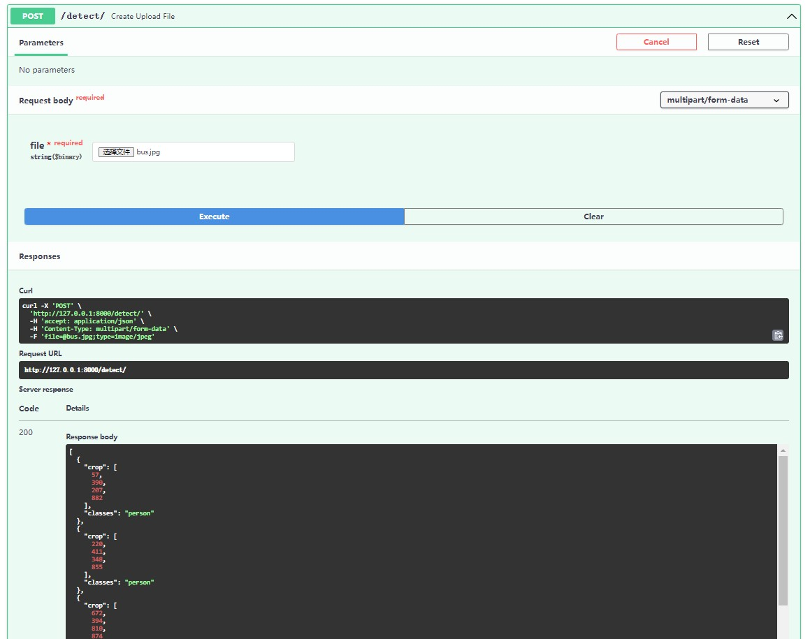

# yolov5_onnx_server


## onnx介绍
ONNX 是一种用于表示机器学习的开放格式 模型。ONNX 定义了一组通用运算符（机器学习和深度学习模型的构建基块）和通用文件格式，使 AI 开发人员能够使用具有各种框架、工具、运行时和编译器的模型。  
官网地址：https://onnx.ai/
## yolov5_onnx_server功能
搭建onnx检测平台，并使用onnx格式模型文件检测目标，可本地使用，也可作为服务的方式，通过API向外部提供服务。

# 安装方式 
python版本：3.9（其他版本未做测试）
```
# clone本代码
git clone https://github.com/luosaidage/yolov5_onnx_server.git
# 安装依赖文件
pip install -r reuirements.txt

# 如需使用onnx硬件加速，需将reuirements里的onnxruntime替换为onnxruntime-gpu
```
## 单机运行
python detect.py  


## 服务部署
```
uvicorn main:app --reload --host 0.0.0.0
```
服务运行时显示如下：  
  
然后打开浏览器访问：127.0.0.1:8000/docs  
  
点击(try it out)，然后上传文件，点击Execute
  

## 客户端请求  
这里列举了python客户端请求方式，详情参考"python亲贵方式_demo.py"文件。